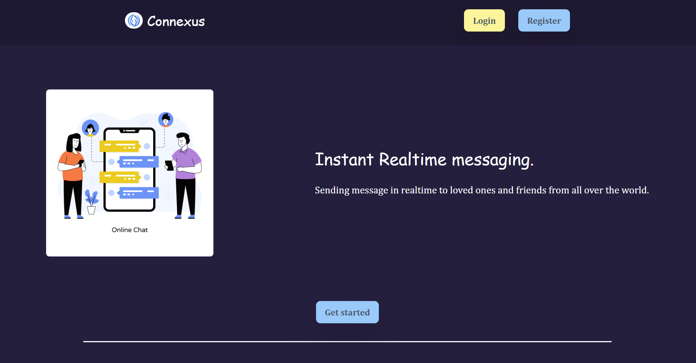
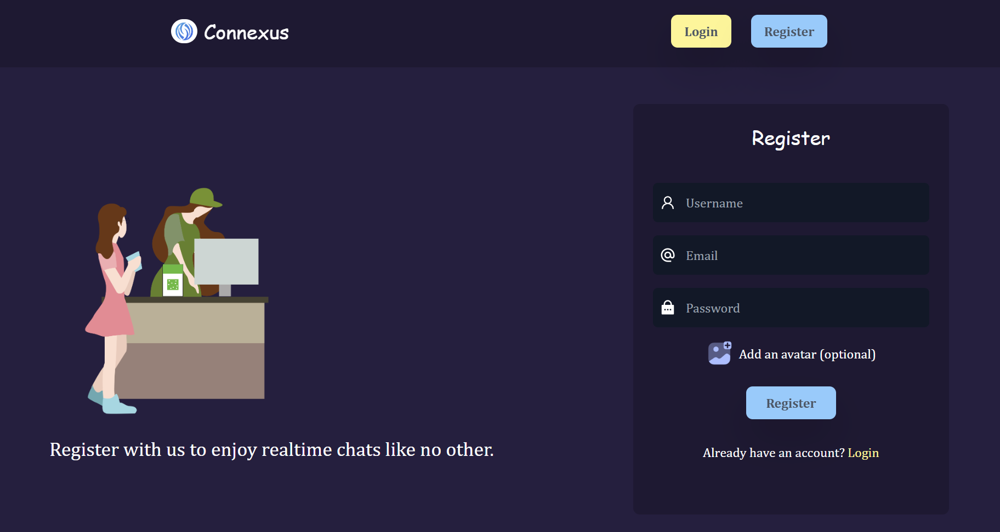
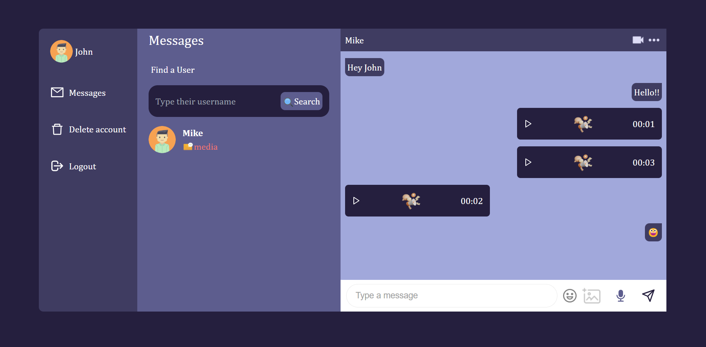

# <h1 align="center">Connexus: Real-Time Messaging Web App</h1>

**A feature-rich real-time messaging platform with instant messaging, and voice messages.**  

 

---

## Project Description

**Connexus** is a real-time messaging web application built using the **MERN stack**. It enables users to send instant messages, and share voice messages in a seamless chat experience. The application leverages **Socket.io** for real-time communication and **JWT authentication** for secure user access.

---

## Table of Contents
- [Project Title and Overview](#project-title-and-overview)
- [Project Description](#project-description)
- [Features](#features)
- [Technology Stack](#technology-stack)
- [Preview](#preview)
- [Installation](#installation)
- [Usage](#usage)
- [Configuration](#configuration)
- [Testing](#testing)
- [License](#license)
- [FAQs](#faqs)
- [Contact Information](#contact-information)

---

## Features

- **Real-time messaging** using Socket.io.
- **Voice message support** for quick audio chats.
- **Secure authentication** with JWT-based login and registration.
- **Modern UI** using React functional components and Context API for state management.
- **RESTful API** built with Node.js and Express.
- **MongoDB integration** for scalable data storage.

---

## Technology Stack

**Frontend**:
- React.js (Functional Components & Hooks)
- Context API for state management
- React Router for navigation
- Tailwind CSS for styling

**Backend**:
- Node.js, Express.js (REST API)
- MongoDB (NoSQL database)
- Mongoose (ORM for MongoDB)
- JWT authentication
- Socket.io (real-time messaging)

**Other Tools**:
- WebSockets (for real-time events)

---

## Preview

Below are some screenshots showcasing Connexus in action:





Explore the platform to dive deeper into its features, interact with real-time messaging, and experience seamless communication!

---

## Installation

To set up the project locally, follow these steps:

1. Clone the repository:
    ```bash
    git clone https://github.com/ThakkarVidhi/mern-messenger.git
    cd mern-messenger
    ```

2. Install the dependencies:

    **Backend Setup:**
    ```bash
    cd backend
    npm install
    ```

    **Frontend Setup:**
    ```bash
    cd frontend
    npm install
    ```

3. Start the application:

    **Start the backend server:**
    ```bash
    cd backend
    npm run dev
    ```

    **Start the frontend server:**
    ```bash
    cd frontend
    npm run dev
    ```

4. Open `http://localhost:5173/` in your browser to start using Connexus.

---

## Usage

1. **Sign Up / Login**  
   Create an account or log in with existing credentials.

2. **Find Friends / Connect with Other People**   
    Search for users and send connection requests to start chatting.

3. **Start Messaging**  
   Select a chat and start sending messages in real-time.

4. **Send Voice Messages**  
   Record and send voice messages directly in the chat.

---

## Configuration

This project uses a `.env` file for managing environment variables. Create a `.env` file in the **backend** directory with the following details:

### Backend (`backend/.env`)

```env
PORT=5000
DB_URI=your_mongodb_connection_string
SECRET=your_jwt_secret
```

---

## Testing

This project does not include automated tests. However, you can manually test the application by running it locally and interacting with the features:

1. Start the backend and frontend servers.
2. Sign up or log in to the application.
3. Find and connect with other users.
4. Send messages, voice messages, and try real-time messaging.
5. Check for any issues or unexpected behavior while using the app.

If you encounter any issues, refer to the browser console or server logs for debugging.

If you have any questions or need assistance, feel free to reach out to me.

---

## License

This project is licensed under the [MIT License](LICENSE).  


---

## FAQs

**Q: How do I sign up and start using the app?**  
**A:** Click on the "Register" button, enter your details, and create an account. Once registered, you can log in and start messaging.

**Q: Can I send voice messages?**  
**A:** Yes, the app supports voice messages. You can record and send them directly within the chat.

**Q: How can I find and connect with other users?**  
**A:** Use the "Find User" feature to search for and connect with other users. Once connected, you can start messaging them.

**Q: Is my data secure?**  
**A:** Yes, all messages and user data are secured using JWT authentication.

**Q: What should I do if I encounter an issue?**  
**A:** If you face any problems, check the browser console or server logs for errors. You can also reach out for support.

If you have additional questions, feel free to contact me!

---

## Contact Information

You can reach me at [vidhithakkar.ca@gmail.com](mailto:vidhithakkar.ca@gmail.com) or via [LinkedIn](https://www.linkedin.com/in/vidhi-thakkar-0b509724a/).